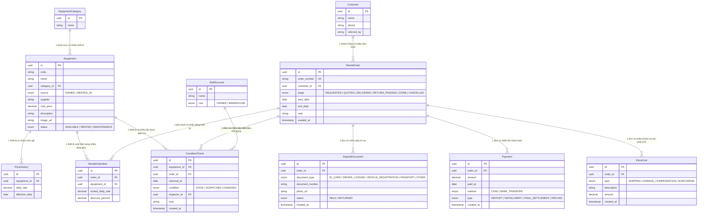

# erd.md — Sơ đồ quan hệ dữ liệu (ERD) CineB Webapp

Vẽ theo đúng mục "4. Dữ liệu cần lưu" trong `design.md` (9 bảng, không thêm/bớt). Tên bảng/cột dùng tiếng Anh; các cột thể hiện trạng thái/loại có tập giá trị cố định trong tài liệu đều khai báo kiểu `enum` (không dùng `string` tự do) — giá trị enum lấy đúng danh sách đã liệt kê trong `design.md`.

## Ghi chú ánh xạ tên bảng (tiếng Việt trong design.md → tiếng Anh trong ERD)

| design.md | erd.md |
|---|---|
| `thiet_bi` | `Equipment` |
| `lich_su_gia` | `PriceHistory` |
| `khach_hang` | `Customer` |
| `don_thue` | `RentalOrder` |
| `don_thue_chi_tiet` | `RentalOrderItem` |
| `coc_giay_to` | `DepositDocument` |
| `thanh_toan` | `Payment` |
| `chi_phi` | `ExtraCost` |
| `kiem_tra_tinh_trang` | `ConditionCheck` |

`EquipmentCategory` không có trong `design.md` gốc — được thêm theo đề xuất đã duyệt (xem mục "Đã duyệt và đưa vào bản vẽ") để tránh sai lệch số liệu gộp nhóm do gõ tay không thống nhất.

---

## Đã duyệt và đưa vào bản vẽ

- ✅ **Timestamp tạo bản ghi** (`created_at`) cho `Payment`, `ExtraCost`, `DepositDocument`, `ConditionCheck` — đã thêm vào sơ đồ ở trên.
- ✅ **Bảng danh mục thiết bị riêng** (`EquipmentCategory`) thay cho `category` chữ tự do — đã thêm vào sơ đồ ở trên (`Equipment.category_id FK`).
- ✅ **Mã đơn dễ đọc** (`order_number`) trên `RentalOrder` — đã thêm vào sơ đồ ở trên.
- ✅ **Ảnh đính kèm** (`Equipment.image_url`, `DepositDocument.photo_url`) — đã thêm vào sơ đồ ở trên. *(Lưu ý: giao diện thật chưa có chỗ tải/chụp ảnh — cần làm thêm phần đó mới dùng được cột này.)*
- ✅ **Bảng nhân sự** (`StaffAccount`) — đã thêm vào sơ đồ ở trên; `ConditionCheck.inspector` đổi thành khóa ngoại `inspector_id`. *(Lưu ý: giao diện thật chưa có đăng nhập thật — vai Chủ/Kho vẫn chỉ là lựa chọn tạm trên trình duyệt, chưa gắn với `StaffAccount` nào; cần làm thêm phần đăng nhập mới dùng được đầy đủ bảng này.)*

Cả 5 đề xuất đã được duyệt và đưa vào bản vẽ chính — không còn đề xuất nào đang chờ.
