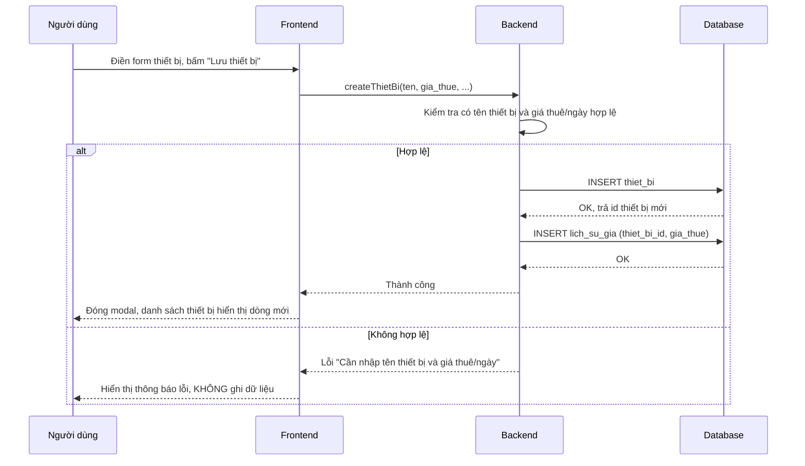
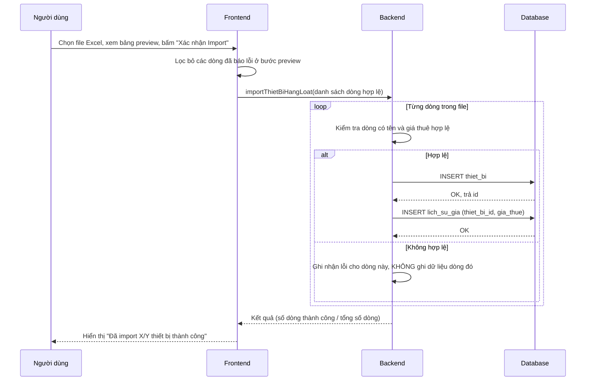
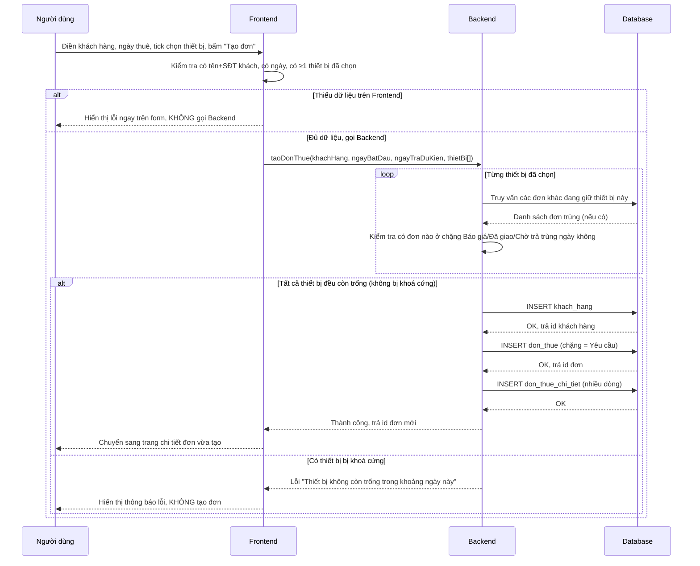
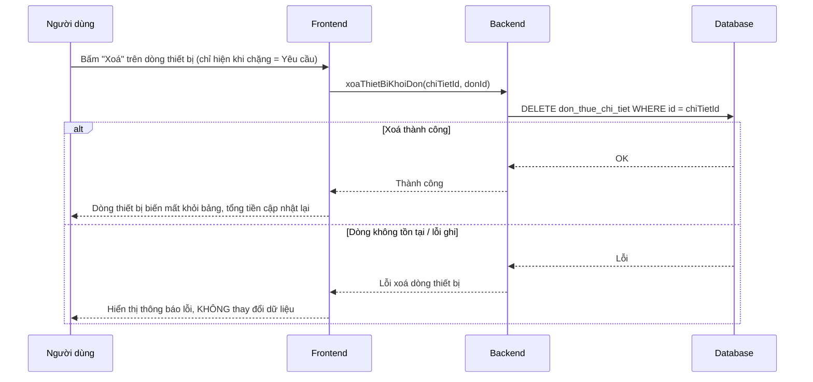
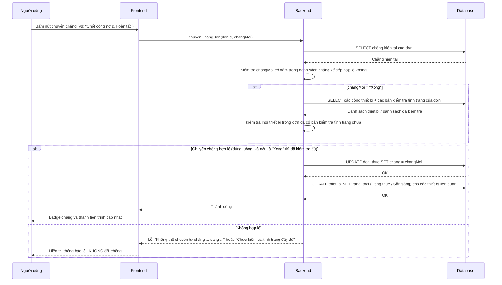
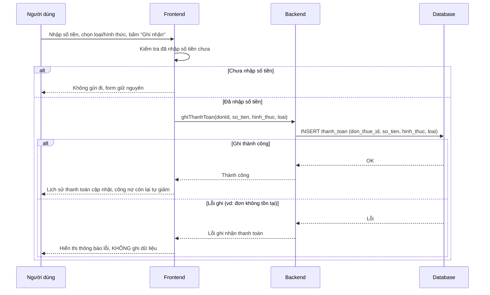
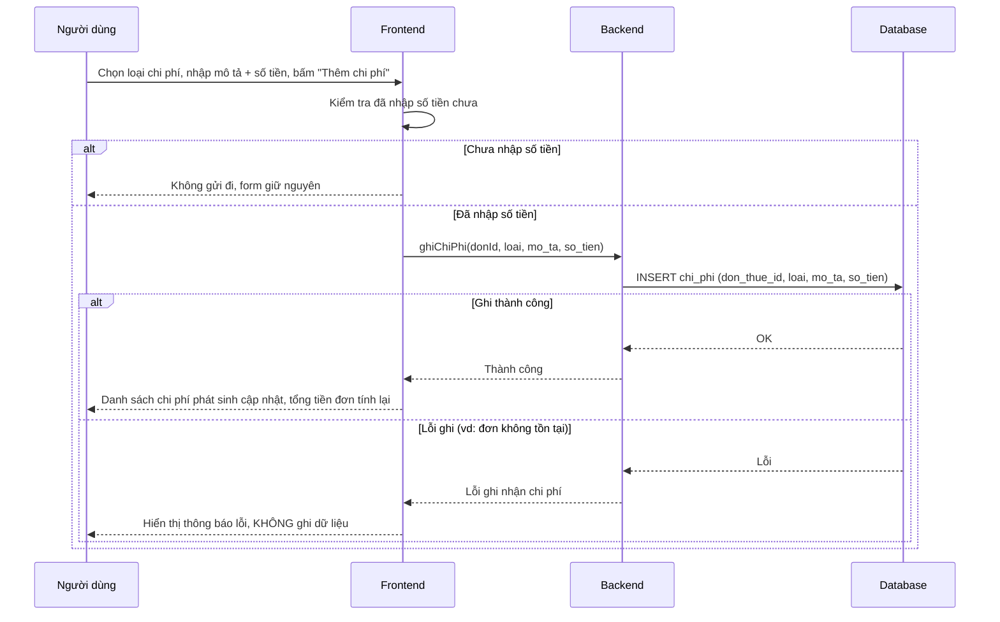
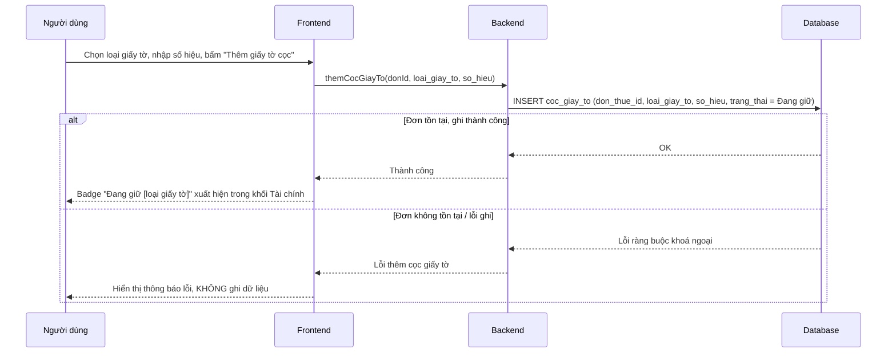
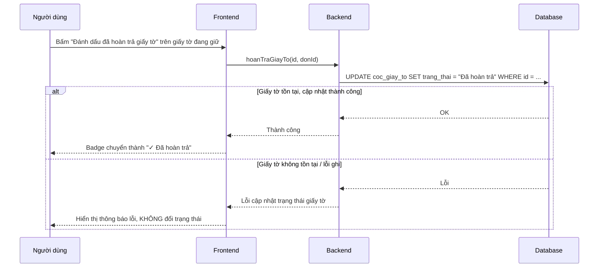
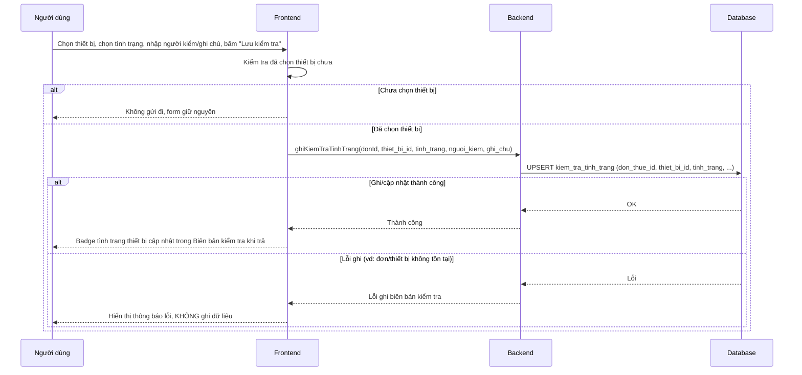

# sequence.md — Sequence Diagram cho các hành động ghi dữ liệu

## 1. Thêm thiết bị mới

## 2. Import Excel danh sách thiết bị

## 3. Tạo đơn thuê mới

## 4. Xoá dòng thiết bị khỏi đơn

## 5. Chuyển chặng đơn thuê

## 6. Ghi nhận thanh toán

## 7. Ghi chi phí phát sinh

## 8. Thêm cọc giấy tờ

## 9. Đánh dấu đã hoàn trả giấy tờ cọc

## 10. Ghi biên bản kiểm tra tình trạng

